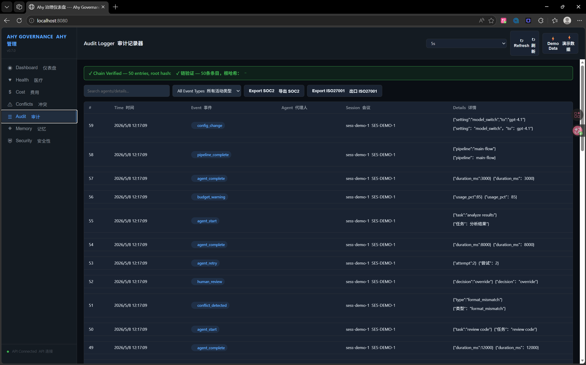

# Ahy Governance

**The first multi-agent governance platform. Conflict detection, cost tracking, audit logging, health monitoring — 7 modules, 312 tests, production-ready.**

[](https://github.com/Leo-Ayh-Oday/ahy-governance/actions)
[](https://python.org)
[](LICENSE)
[](https://pypi.org/project/ahy-governance/)

When you deploy 10+ AI agents, five things break — Ahy Governance fixes all of them:

1. **Agents contradict each other** → 5-type conflict detection
2. **Token bills arrive blind** → Per-agent cost tracking + budget circuit breaker
3. **Nobody audited what happened** → SHA-256 hash chain, SOC2/ISO27001 export
4. **Agents fail silently** → Heartbeat monitoring, P50/P95/P99 latency, DAG visualization
5. **No access control** → 3-tier RBAC + API key lifecycle management
6. **Prompt injection attacks** → 13 injection patterns + PII redaction

---

## Why Ahy Governance?

| Capability | Ahy Governance | LangSmith | LangFuse | Datadog |
|------------|---------------|-----------|----------|---------|
| LLM call tracing | ✅ | ✅ | ✅ | ✅ |
| **Multi-agent conflict detection** | ✅ 5 types | ❌ | ❌ | ❌ |
| **Cross-agent cost attribution** | ✅ Per-agent | Partial | Partial | ❌ |
| **Tamper-proof audit (SHA-256)** | ✅ SOC2/ISO | ❌ | ❌ | Partial |
| **RBAC + API key management** | ✅ 3-tier | ❌ | ❌ | ✅ |
| **Prompt injection defense** | ✅ 13 rules | ❌ | ❌ | ❌ |
| **Cross-agent memory sharing** | ✅ Namespaced | ❌ | ❌ | ❌ |
| **Pricing model** | Per Agent | Per Seat | Per Seat | Per Host |
| **Open source** | ✅ MIT | ❌ | ✅ MIT | ❌ |

> LangSmith and LangFuse are excellent LLM observability tools. But they trace individual API calls — they don't understand multi-agent orchestration. Ahy Governance is purpose-built for systems where 5+ agents collaborate, conflict, and need coordination.

---

## Who Is This For?

- You're building agents with LangChain/CrewAI, and your boss asks "is this secure?" — you have no monitoring dashboard
- Your compliance audit is due, and the auditor demands traceable decision logs for every agent
- You manage 20+ agents but have no idea what each one costs, or whether their outputs contradict each other
- You need SOC 2 / ISO 27001 evidence for your AI systems, and spreadsheets won't cut it

If any of these hit close — **you're the exact user we built this for.**

---

## Quick Start

```bash
pip install ahy-governance[web]
ahy-dashboard
# Open http://localhost:8080 — click "Demo Data" to populate
```

Or use individual modules:

```python
from ahy_governance import ConflictDetector, CostTracker, AuditReporter

# Detect conflicts between agents
detector = ConflictDetector()
conflicts = detector.check(agent_outputs, dag_definition)

# Track costs per agent
tracker = CostTracker()
tracker.set_budget(limit_usd=100)
tracker.track("Planner", "claude-opus-4-7", tokens_in=15000, tokens_out=8000)

# Tamper-proof audit logging
auditor = AuditReporter()
auditor.log(AuditEventType.AGENT_START, "Planner", {"task": "plan"})
```

---

## Web Dashboard

Launch with one command. 7 panels, dark theme, auto-refresh.

```
ahy-dashboard
```

| Panel | What it shows |
|-------|--------------|
| **Dashboard** | Agent health overview, total cost, audit integrity, budget gauge |
| **Health** | Per-agent status badges, P50/P95/P99 latency, success rates |
| **Cost** | Budget gauge, cost by agent/model, per-call entry log |
| **Conflicts** | JSON sandbox — paste outputs + DAG, click "Check" |
| **Audit** | Hash-chained event log, integrity verification, SOC2/ISO27001 export |
| **Memory** | Namespace browser, key-value search, cross-agent shared state |
| **Security** | RBAC workspace/user/key management + Prompt Guard sandbox |



---

## Architecture

```
┌──────────────────────────────────────────────────────┐
│              Ahy Governance Dashboard                 │
│  ┌──────────┐ ┌──────────┐ ┌──────────┐ ┌────────┐  │
│  │ Conflict │ │   Cost   │ │  Audit   │ │ Health │  │
│  │ Detector │ │ Tracker  │ │ Reporter │ │Monitor │  │
│  └──────────┘ └──────────┘ └──────────┘ └────────┘  │
├──────────────────────────────────────────────────────┤
│                 Governance Core                       │
│  ┌──────────┐ ┌──────────┐ ┌──────────────────────┐  │
│  │  Memory  │ │   RBAC   │ │    Prompt Guard      │  │
│  │ Sharing  │ │          │ │ (Injection + PII)    │  │
│  └──────────┘ └──────────┘ └──────────────────────┘  │
├──────────────────────────────────────────────────────┤
│      Existing Agent Core (not included — bring your own)  │
│      Orchestrator  │  TraceLogger  │  Router         │
└──────────────────────────────────────────────────────┘
```

---

## Modules (7/7 complete)

| # | Module | Tests | Description |
|---|--------|-------|-------------|
| 1 | Conflict Detector | 23 | 5 conflict types: fact, format, dependency, scope, confidence |
| 2 | Cost Tracker | 46 | 22 model pricings, budget circuit breaker, per-agent attribution |
| 3 | Audit Reporter | 35 | SHA-256 hash chain, SOC2/ISO27001 compliance export |
| 4 | Health Monitor | 45 | Heartbeats, P50-P99 latency, error rates, DAG pipeline tracking |
| 5 | RBAC + API Keys | 41 | 3-tier roles, API key lifecycle, multi-tenant isolation |
| 6 | Prompt Guard | 39 | 13 injection patterns, PII redaction, sanitize pipeline |
| 7 | Memory Sharing | 34 | Namespaced key-value, TTL expiry, tag search |

**312 tests, 0 failures.** Every module has an in-memory singleton accessed via `get_X()`.

---

## SOC 2 / ISO 27001 Compliance

The **Audit Reporter** module is the most commercially valuable piece of this platform. It doesn't just log — it produces compliance-ready evidence:

- **SHA-256 hash chain** — every audit entry is cryptographically linked to its predecessor. Tamper with one entry, the entire chain fails verification.
- **SOC 2 export** — one-click report covering Security, Availability, Confidentiality, Processing Integrity, and Privacy control domains
- **ISO 27001 export** — Annex A controls (A.9, A.10, A.12, A.16, A.18) with compliant/needs-review status per control

For companies facing their first AI compliance audit: this turns a 2-week manual evidence-gathering process into a 5-minute export. **SOC 2 Compliance Pack available as a +$299/mo add-on on any paid tier.**

---

## Pricing

**Per-Agent pricing** — pay for agents you govern, not human seats. One 20-person team managing 50 agents pays for 50 agents, not 20 seats.

| Tier | Price | Agents | Includes |
|------|-------|--------|----------|
| Community | Free | 1 | All 7 modules, local deployment |
| Pro | $149/mo | 10 | Conflict detection, cost tracking, email support |
| Team | $499/mo | 50 | RBAC, audit reports, priority support |
| Enterprise | Contact Us | Unlimited | SSO/SAML, private deployment, SLA, dedicated support |

**SOC 2 Compliance Pack:** +$299/mo — automated SOC 2 / ISO 27001 audit report generation. Available on any paid tier.

**Agent Governance Integration Package:** ¥80K–150K per engagement — MCP connector development, private deployment, custom rule configuration.

---

## Ecosystem

| Project | Description | Status |
|---------|-------------|--------|
| [Kingdee MCP Server](https://github.com/Leo-Ayh-Oday/kingdee-mcp-server) | AI Agent ↔ 金蝶云星空 ERP | ✅ MIT |
| [WeCom MCP Server](https://github.com/Leo-Ayh-Oday/wecom-mcp-server) | AI Agent ↔ 企业微信 | ✅ MIT |
| [Ahy Agent](https://github.com/Leo-Ayh-Oday/ahy-agent) | Multi-agent orchestration harness | v0.6.0 |

---

## Community

- **Discord**: [Join our server](https://discord.gg/your-invite-link) — questions, feedback, early access
- **Issues**: [GitHub Issues](https://github.com/Leo-Ayh-Oday/ahy-governance/issues) — bug reports, feature requests
- **Stars help**: If this project is useful, a GitHub star helps others discover it

---

## Contributing

PRs welcome. See [CONTRIBUTING.md](CONTRIBUTING.md).

---

MIT License. Built by [Leo-Ayh-Oday](https://github.com/Leo-Ayh-Oday).
